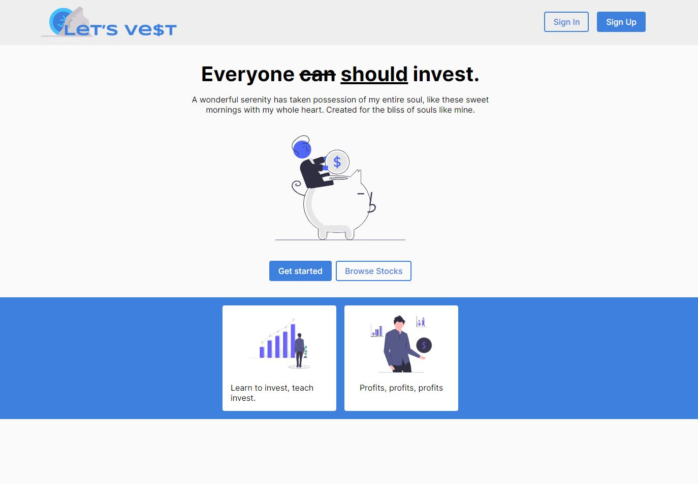

# Let's Vest (BETA)

Let's vest is a website where you can see stock market information and information about crypto. You can share your portfolio/account to other accounts on the website. Make posts, see other posts and like other posts. Earn achievements where you can display your reward on your profile.

## Created by

- **Jesper Pettersson** [github](https://github.com/Jesper-dev)
- **Jon Sundelöf** [github](https://github.com/jon-sundelof)
- **Kevin Namousi** [github](https://github.com/kevinnam)
- **Anton L-A** [github](https://github.com/xamnotna)

### Features

- **Create an account**
- **Create an organization**
- **Invest fictional money**
- **Watch stockmarket information**
- **Watch crypto information**
- **See information about other accounts**
- **Message other accounts**
- **Make posts about almost anything**
- **Earn achievements**

#### Screenshot

[Trello](https://trello.com/b/aSBjDnhs/tp2-b-e-v)
